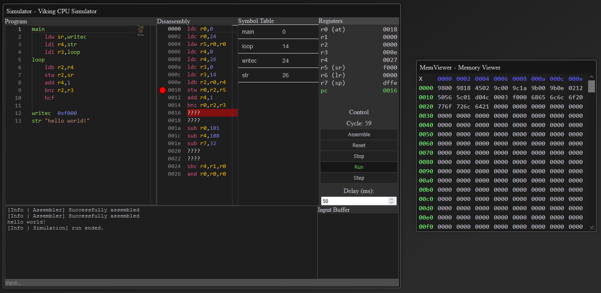

# Viking Sim Web

Simulador da viking CPU utilizando React.js & Monaco-Editor.

Link site: [https://vanflux.github.io/viking-sim-web/](https://vanflux.github.io/viking-sim-web/)

A implementação original foi feita por [sjohann81](https://github.com/sjohann81/) utiliza python2 e pode ser encontrada [AQUI](https://github.com/sjohann81/viking/).

Esta implementação tem o objetivo de fazer algumas melhorias como por exemplo: o editor de código, na implementação original é um editor de texto simples, já nesta, foi utilizado o monaco-editor que possui syntax highlight e outras ferramentas como busca(ctrl+f), desfazer(ctrl+z), refazer(ctrl+y).

---

Caí aqui de paraquedas:
- Nesse caso, recomenda-se olhar a documentação do repositório oficial, lá é explicado como que a arquitetura funciona e são oferecidos vários exemplos: [https://github.com/sjohann81/viking/](https://github.com/sjohann81/viking/)

---

Screenshot da aplicação:

##### **Atualmente, não é suportado pelo Internet Explorer & mobile(não responsivo).**

---

Operações básicas ✔️:
| Operação  | Descrição                    | Operação  | Descrição                    |
|-----------|------------------------------|-----------|------------------------------|
| AND       | Logical product              | LDC       | Load constant                |
| OR        | Logical sum                  | LSR       | Logical shift right          |
| XOR       | Logical difference           | ASR       | Arithmetic shift right       |
| SLT       | Set if less than             | ROR       | Rotate right through carry   |
| SLTU      | Set if less than (unsigned)  | LDB       | Load byte                    |
| ADD       | Add                          | STB       | Store byte                   |
| ADC       | Add with carry               | LDW       | Load word                    |
| SUB       | Subtract                     | STW       | Store word                   |
| SBC       | Subtract with carry          | BEZ       | Branch if equal zero         |
| LDR       | Load register                | BNZ       | Branch if not equal zero     |

---

Pseudo operações 🟡 (em desenvolvimento):

| Operação  | Descrição                       | Operação  | Descrição                       |
|-----------|---------------------------------|-----------|---------------------------------|
| ✔️ HCF    | Halt and catch fire             | ✔️ POP    | Pop to register from stack      |
| ✔️ LDI    | Load immediate                  | ✔️ PUSH   | Push register to stack          |
| ✔️ LSL    | Logical shift left              | ⭕ ret    | Return                          |
| ✔️ nop    | No operation                    | ✔️ not    | One’s complement                |
| ✔️ neg    | Two’s complement                | ✔️ mov    | Move register                   |
| ⭕ rol    | Rotate left through carry       | ⭕ lsrm   | Logical shift right multiple    |
| ⭕ asrm   | Arithmetic shift right multiple | ⭕ lslm   | Logical shift left multiple     |
| ⭕ seq    | Set if equal                    | ⭕ sne    | Set if not equal                |
| ⭕ sge    | Set if greater equal            | ⭕ sgeu   | Set if greater equal (unsigned) |
| ⭕ beq    | Branch if equal                 | ⭕ bne    | Branch if not equal             |
| ⭕ blt    | Branch if less than             | ⭕ bge    | Branch if greater equal         |
| ⭕ bltu   | Branch if less than (unsigned)  | ⭕ bgeu   | Branch if greater equal(unsined)|
| ⭕ sgt    | Set if greater equal            | ⭕ sle    | Set if less equal               |
| ⭕ sgtu   | Set if greater than (unsigned)  | ⭕ sleu   | Set if less equal (unsigned)    |
| ⭕ bgt    | Branch if greater than          | ⭕ ble    | Branch if less equal            |
| ⭕ bgtu   | Branch if greater than(unsigned)| ⭕ bleu   | Branch if less equal(unsigned)  |
| ⭕ jmp    | Jump                            | ⭕ jal    | Jump and link                   |
| ⭕ jmpr   | Jump register                   | ⭕ jalr   | Jump and link register          |

---

* Para fazer operações I/O como ler/escrever no console ou interagir com o canvas é **Recomendado** usar os simbolos pré definidos ao invés dos endereços de forma fixa (0xf000, 0xf002). O motivo disso é que futuramente pretende-se suportar a arquitetura 32 bits e nela os endereços para fazer essas operações mudam, por exemplo: 0xf000 -> 0xf0000000 (writec).

* Símbolos pré definidos I/O
  * Console:
    * `console_writec`: Printa um caractere no output do console
    * `console_writei`: Printa um inteiro no output do console
    * `console_readc`: Lê um caractere do input do usuário
    * `console_readi`: Lê um inteiro do input do usuário
  * Canvas (experimental, veja os [Exemplos](./examples/canvas/) para enteder melhor):
    * `canvas_clear`: Apaga/limpa o canvas
    * `canvas_clearLine`: Apaga os pixels de uma linha (apaga uma linha)
    * `canvas_clearPixel`: Apaga um pixel
    * `canvas_drawLine`: Desenha uma linha
    * `canvas_drawPixel`: Desenha um pixel
    * `canvas_setP1`: Seta a primeira posição
    * `canvas_setP2`: Seta a segunda posição
    * `canvas_setX`: Seta o eixo X
    * `canvas_setY`: Seta o eixo Y